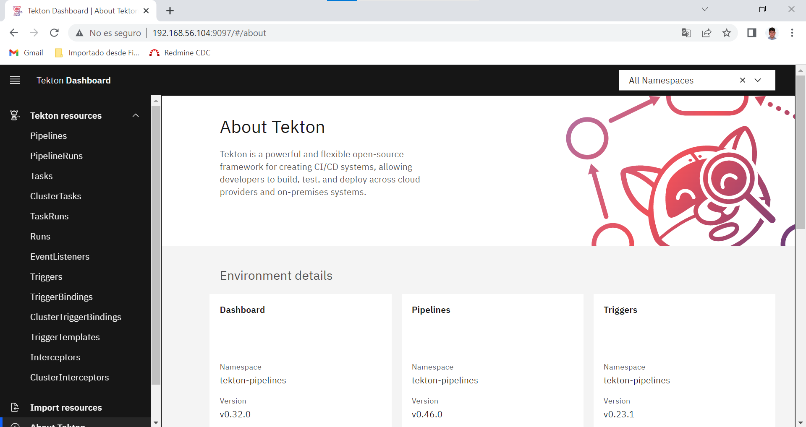
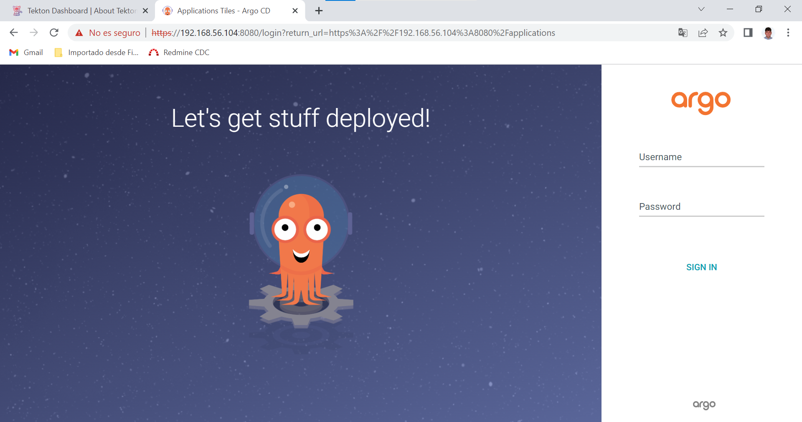
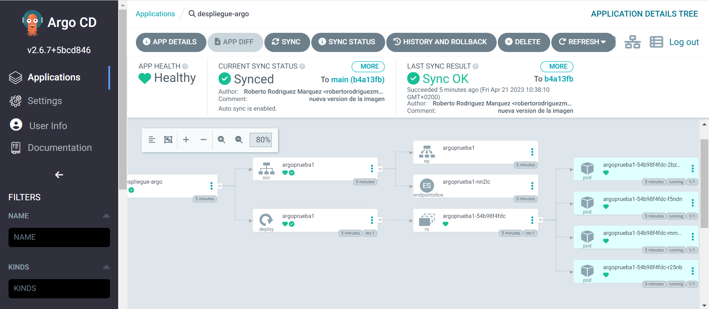
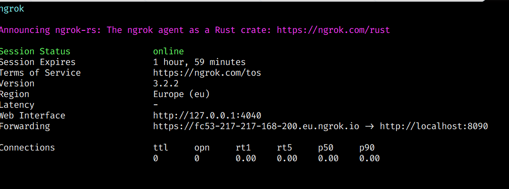
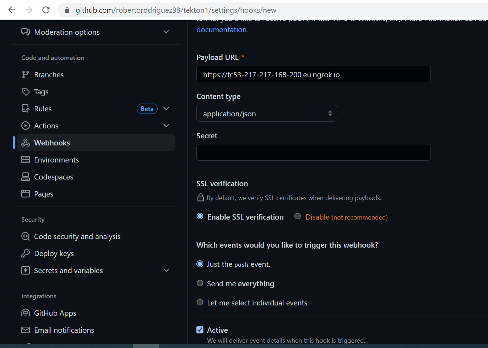

# Ciclo CI/CD con Tekton y ArgoCD

## Requisitos

**Local**

* Clúster de kubernetes (en mi caso, minikube)
* Kubectl
* Bash

**Infraestructura**

* Cuenta de dockerhub
* Permisos sobre el repositorio [https://github.com/robertorodriguez98/argocd1](https://github.com/robertorodriguez98/argocd1)
* Token de github con los siguientes permisos: repo, admin:org y admin:repo_hook.

## Propósito del repositorio

Este repositorio contiene los archivos necesarios para crear un pipeline de tekton que se encargará de crear una imagen docker, subirla a dockerhub y actualizar el repositorio de argocd con los cambios realizados.

El funcionamiento es el siguiente:

1. Desarrollador modifica el index.html.
2. Al hace un push, salta un webhook que conecta con un EventListener de tekton, que ejecuta el pipeline que realiza lo siguiente:
    * Clona el repositorio.
    * Se construye la imagen docker y se sube a dockerhub.
    * Se actualiza el repositorio de argocd con la nueva versión de la imagen.
3. ArgoCD detecta los cambios en el repositorio y despliega la nueva versión de la aplicación.

## Pasos a seguir

1. Clonar en este repositorio en nuestra máquina, en caso de que tengamos git instalado en nuestro pc usareamos el siguiente comando:

```bash
git clone https://github.com/robertorodriguez98/tekton1.git
```

En el caso de no tener instalado git podremos descargarnos el repositorio comprimido. En la página principal del repositorio pulsaremos el botón verde, **Code** , y eligiremos la opción **Download ZIP**.

2. Creamos un token de github, siguiendo los siguientes pasos:
    1. Hacemos click en el logo de nuestro usuario arriba a la derecha.
    2. Seleccionamos **Settings**.
    3. Seleccionamos **Developer settings**.
    4. Seleccionamos **Personal access tokens**.
    5. Generamos un nuevo token, con los sigientes permisos:
        * repo
        * admin:org
        * admin:repo_hook
3. Instalamos minikube; vamos a usar como driver docker, por lo que lo instalamos también:

```bash
sudo apt install docker.io
sudo usermod -aG docker usuario
curl -LO https://storage.googleapis.com/minikube/releases/latest/minikube-linux-amd64
sudo install minikube-linux-amd64 /usr/local/bin/minikube
minikube start --driver=docker
```

4. Instalamos kubectl, siguiendo los siguientes pasos:

```bash
curl -LO "https://storage.googleapis.com/kubernetes-release/release/$(curl -s https://storage.googleapis.com/kubernetes-release/release/stable.txt)/bin/linux/amd64/kubectl"
sudo install kubectl /usr/local/bin/kubectl
```

5. Ahora creamos los secret que usaremos en el pipeline:
    * **dockerhub**:
        1. iniciamos sesión con la línea de comandos (las mimas credenciales en ambos comandos):
        ```bash
         docker login index.docker.io 
         docker login
        ```
        2. copiamos el contenido del archivo **config.json** que se ha creado en la carpeta **.docker** de nuestro usuario, y lo codificamos en base64:
        ```bash
        cat ~/.docker/config.json | base64 -w0 
        ```
        3. Creamos el fichero docker-credentials.yaml con el siguiente contenido:
        ```yaml
        apiVersion: v1
        kind: Secret
        metadata:
          name: docker-credentials
        data:
          config.json: <contenido codificado en base64>
        ```
        4. finalmente creamos el secret:
        ```bash
        kubectl apply -f docker-credentials.yaml
        ```
    * **github**:
        1. Creamos el fichero github-credentials.yaml con el siguiente contenido:
        ```yaml
        kind: Secret
        apiVersion: v1
        metadata:
        name: basic-auth
        type: Opaque
        stringData:
        .gitconfig: |
            [credential "https://github.com"]
            helper = store
        .git-credentials: |
            https://robertorodriguez98:<token de github>@github.com
        ```
        2. finalmente creamos el secret:
        ```bash
        kubectl apply -f github-credentials.yaml
        ```
6. Instalamos tekton, siguiendo los siguientes pasos:
    1. Instalamos tekton-pipelines:
    ```bash
    kubectl apply --filename https://storage.googleapis.com/tekton-releases/pipeline/latest/release.yaml
    ```
    2. Instalamos los triggers:
    ```bash
    kubectl apply --filename \
    https://storage.googleapis.com/tekton-releases/triggers/latest/release.yaml
    kubectl apply --filename \
    https://storage.googleapis.com/tekton-releases/triggers/latest/interceptors.yaml
    ```
    3. Instalamos el dashboard:
    ```bash
    kubectl apply -f https://storage.googleapis.com/tekton-releases/dashboard/previous/v0.32.0/release-full.yaml
    ```
    4. Para acceder al dashboard, ejecutamos el siguiente comando:
    ```bash
    kubectl port-forward -n tekton-pipelines service/tekton-dashboard 9097:9097 -a 0.0.0.0
    ```
    y accedemos a [http://localhost:9097/](http://localhost:9097/)

7. instalamos argoCD:
    1. instalamos el cliente de argoCD:
    ```bash
    kubectl create namespace argocd
    kubectl apply -n argocd -f https://raw.githubusercontent.com/argoproj/argo-cd/stable/manifests/install.yaml
    ```
    2. Para acceder al dashboard, ejecutamos el siguiente comando:
    ```bash
    kubectl port-forward svc/argocd-server -n argocd 8080:80 --address=0.0.0.0
    ```
    
    3. Obtenemos las credenciales de argoCD:
        * Usuario: admin
        * Contraseña `kubectl -n argocd get secret argocd-initial-admin-secret -o jsonpath="{.data.password}" | base64 -d;echo`
    4. Ejecutamos la aplicación una primera vez:
    ```bash
    kubectl apply -f https://raw.githubusercontent.com/robertorodriguez98/argocd1/main/app.yaml
    ```


8. Ejecutamos el pipeline:
    1. Copiamos el repositorio y nos movemos a la carpeta:
    ```bash
    git clone https://github.com/robertorodriguez98/tekton1.git && cd tekton1
    ```
    2. instalamos las tareas necesarias:
    ```bash
    kubectl apply -f https://raw.githubusercontent.com/tektoncd/catalog/main/task/git-clone/0.9/git-clone.yaml
    kubectl apply -f https://raw.githubusercontent.com/tektoncd/catalog/main/task/kaniko/0.6/kaniko.yaml
    ```
    3. aplicamos los manifiestos necesarios
    ```bash
    kubectl apply -f pipeline.yaml,tasks.yaml,triggers-rbac.yaml,trigger-binding.yaml,trigger-template.yaml,event-listener.yaml
    ```
    Los manifiestos que hemos aplicado son los siguientes:

    * **pipeline.yaml**: contiene la definición del pipeline.
    * **tasks.yaml**: contiene la definición de las tareas que se ejecutarán en el pipeline.
    * **triggers-rbac.yaml**: contiene la definición de los roles y los rolesbindings necesarios para que los triggers funcionen.
    * **trigger-binding.yaml**: contiene la definición del trigger binding, que permite extraer datos de un evento y mandarlos al trigger-template.
    * **trigger-template.yaml**: contiene la definición del trigger template, que permite definir los recursos que se crearán cuando se dispare el trigger, entre ellos el pipelinerun que ejecutará el pipeline.
    * **event-listener.yaml**: permite procesar eventos basados en http con datos json, en este caso lo usamos para conectarlo a github usando un webhook.

    4. Para que el event listener funcione, también hay que hacer un port forward del servicio:
    ```bash
    kubectl port-forward service/el-github-pr 8090:8080 --address=0.0.0.0
    ```

8. Creamos el webhook en github:

    1. ejecutamos ngrok aputando al puerto del event listener (8090)
    ```bash
    wget https://bin.equinox.io/c/bNyj1mQVY4c/ngrok-v3-stable-linux-amd64.tgz
    sudo tar xvzf ngrok-v3-stable-linux-amd64.tgz -C /usr/local/bin
    ngrok http 8090
    ```
    

    2. Vamos a la página principal del repositorio.
    3. Seleccionamos **Settings**.
    4. Seleccionamos **Webhooks**.
    5. Seleccionamos **Add webhook**.
    6. En **Payload URL** introducimos la url de ngrok y dejamos las opciones como en la imagen:
    

Ahora, solo quedaría hacer un push al repositorio para que se ejecute el pipeline!  :smile::smile::smile:


